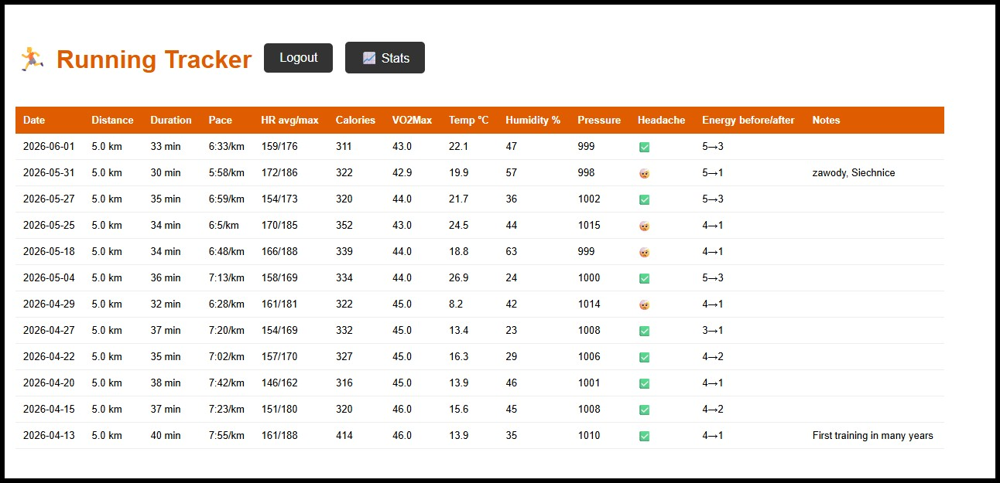
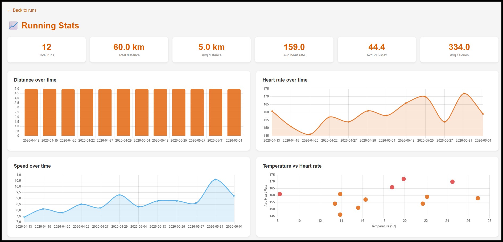
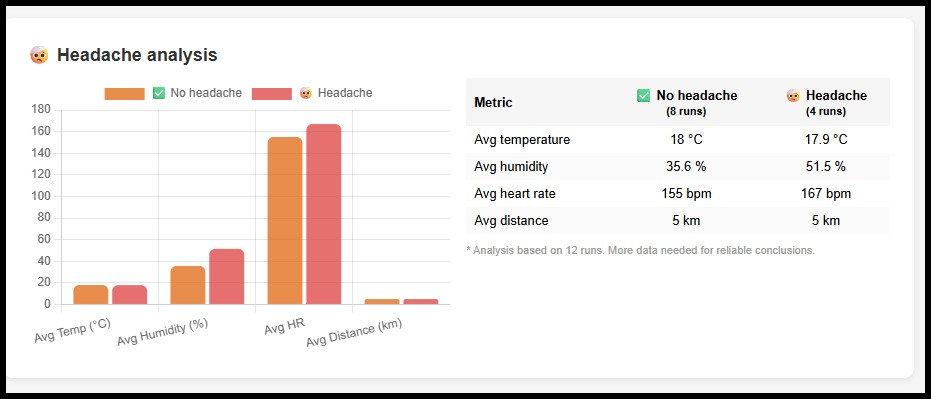
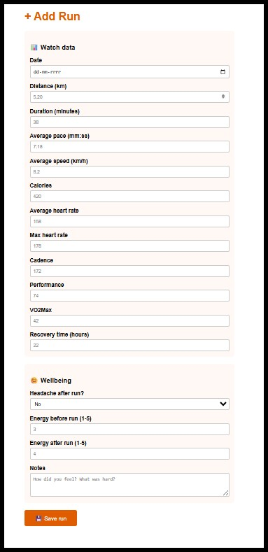

# 🏃 Running Tracker

A personal running data tracker built with Flask and SQLite. Logs workout data from a Huawei smartwatch, automatically fetches weather conditions, and analyzes correlations between running performance, weather, and wellbeing — including post-run headache occurrence.

**Live demo:** https://runningtracker.pythonanywhere.com

---

## Screenshots






---

## Features

- Log running sessions with detailed metrics from a smartwatch (distance, pace, heart rate, VO2Max, recovery time, and more)
- Automatic weather data fetching via [Open-Meteo API](https://open-meteo.com/) (temperature, pressure, humidity) based on run date
- Wellbeing tracking — energy levels before/after run, post-run headache occurrence
- Statistics dashboard with interactive charts:
  - VO2Max trend over time
  - Heart rate and speed progression
  - Temperature vs heart rate scatter plot
  - Recovery time and calories burned
  - Headache analysis — comparing weather and performance conditions
  - Energy levels before vs after run
- Password-protected data entry
- Mobile-friendly — accessible from phone after outdoor runs

---

## Tech Stack

| Layer | Technology |
|-------|------------|
| Backend | Python, Flask |
| Database | SQLite |
| Weather API | Open-Meteo (free, no API key required) |
| Frontend | HTML, CSS, Chart.js |
| Hosting | PythonAnywhere |
| Version control | Git, GitHub |

---

## Project Structure

```
running-tracker/
├── app.py              # Flask application, routes, weather API integration
├── setup_db.py         # Database schema creation
├── requirements.txt    # Python dependencies
├── templates/
│   ├── index.html      # Home page — runs table
│   ├── stats.html      # Statistics dashboard with charts
│   ├── add.html        # Add run form
│   └── login.html      # Password protected login
└── docs/
    └── screenshots/
```

---

## Database Schema

Three normalized tables connected by date and foreign key:

```sql
runs        -- workout metrics from smartwatch
weather     -- automatically fetched weather conditions
wellbeing   -- subjective post-run feelings and headache tracking
```

---

## Getting Started

### Prerequisites
- Python 3.10+
- pip

### Installation

```bash
git clone https://github.com/GrzyboZAUR/running-tracker
cd running-tracker
pip install -r requirements.txt
```

Create a `.env` file in the project root:

```
SECRET_KEY=your-secret-key
DATABASE=running.db
ADMIN_PASSWORD=your-password
```

Initialize the database:

```bash
python setup_db.py
```

Run the application:

```bash
python app.py
```

Open http://127.0.0.1:5000 in your browser.

---

## Research Questions

This project is designed to grow over time and answer personal questions such as:

- Does post-run headache correlate with high temperature or low atmospheric pressure?
- Does heart rate decrease at the same speed over time (indicator of improving fitness)?
- Is VO2Max improving after returning to running after a 15-year break?
- Does energy level before a run affect performance?

> ⚠️ Currently based on a small dataset. Conclusions will become more reliable after 30+ runs.

---

## Roadmap

- [ ] Deploy to Azure App Service with Azure SQL Database
- [ ] CI/CD pipeline with GitHub Actions
- [ ] Add atmospheric pressure correlation analysis
- [ ] Jupyter Notebook with deeper statistical analysis
- [ ] Export data to CSV

---

## Author

Built as a portfolio project combining personal data, SQL, Python, and web development.
