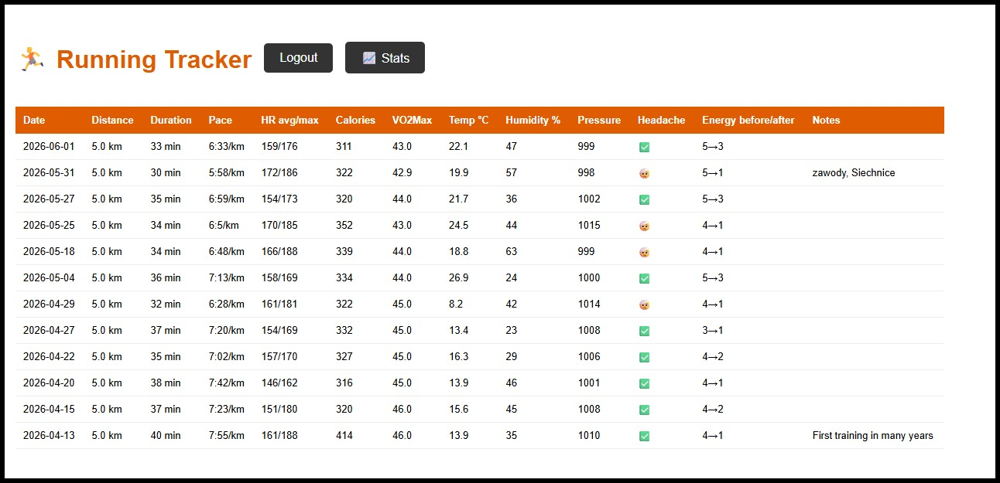
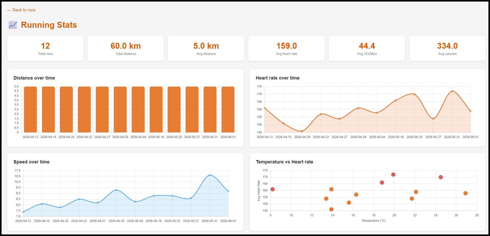
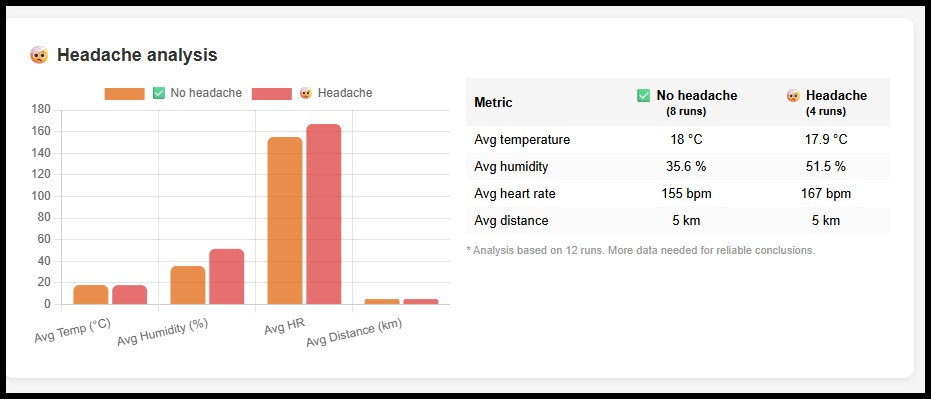
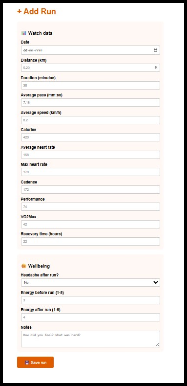

🏃🚴 Activity Tracker

A personal fitness tracker built with Flask and SQLite. Logs running and cycling data from a Huawei smartwatch, automatically fetches weather conditions, and analyzes correlations between performance, weather, and wellbeing — including post-workout headache occurrence.

Live demo: https://runningtracker.pythonanywhere.com

---

## Screenshots






---

Features
🏃 Running
Log running sessions with detailed metrics from a smartwatch (distance, pace, heart rate, VO2Max, recovery time, and more)
Statistics dashboard with interactive charts:
VO2Max trend over time
Heart rate and pace/speed progression
Temperature vs heart rate scatter plot
Recovery time and calories burned
Atmospheric pressure change vs headache occurrence
Energy levels before vs after run

🚴 Cycling
Log cycling sessions (distance, speed, heart rate, training effect, calories, recovery time)
Separate statistics dashboard with the same analysis approach as running

General
Automatic weather data fetching via Open-Meteo API (temperature, pressure, humidity) based on workout date
Automatic atmospheric pressure fetching for the previous day to calculate pressure change
Wellbeing tracking — energy levels before/after workout, post-workout headache occurrence
Headache analysis — comparing weather and performance conditions between headache and no-headache sessions
Password-protected data entry
Mobile-friendly — accessible from phone right after outdoor workouts

---

## Tech Stack

| Layer | Technology |
|-------|------------|
| Backend | Python, Flask |
| Database | SQLite |
| Weather API | Open-Meteo (free, no API key required) |
| Frontend | HTML, CSS, Chart.js |
| Hosting | PythonAnywhere |
| Version control | Git, GitHub |

---

Project Structure
```
running-tracker/
├── app.py                  # Flask application, routes, weather API integration
├── setup_db.py             # Database schema creation
├── fetch_pressure.py       # One-time script to backfill historical pressure data
├── requirements.txt        # Python dependencies
├── templates/
│   ├── index.html          # Home page — runs table
│   ├── rides.html          # Cycling page — rides table
│   ├── stats.html          # Running statistics dashboard
│   ├── stats_rides.html    # Cycling statistics dashboard
│   ├── add.html            # Add run form
│   ├── add_ride.html       # Add ride form
│   └── login.html          # Password protected login
└── docs/
    └── screenshots/
```

---

## Database Schema

Six normalized tables connected by date and foreign key:

```sql
runs            -- running metrics from smartwatch
rides           -- cycling metrics from smartwatch
weather         -- automatically fetched weather conditions (shared)
weather_prev    -- previous day pressure for change calculation
wellbeing       -- subjective post-run feelings and headache tracking
wellbeing_rides -- subjective post-ride feelings and headache tracking
```

---

## Getting Started

### Prerequisites
- Python 3.10+
- pip

### Installation

```bash
git clone https://github.com/GrzyboZAUR/running-tracker
cd running-tracker
pip install -r requirements.txt
```

Create a `.env` file in the project root:

```
SECRET_KEY=your-secret-key
DATABASE=running.db
ADMIN_PASSWORD=your-password
```

Initialize the database:

```bash
python setup_db.py
```

Run the application:

```bash
python app.py
```

Open http://127.0.0.1:5000 in your browser.

---

## Research Questions

This project is designed to grow over time and answer personal questions such as:

Does post-workout headache correlate with high temperature or low atmospheric pressure?
Does atmospheric pressure change between days trigger headaches more than absolute pressure?
Does heart rate decrease at the same speed over time (indicator of improving fitness)?
Is VO2Max improving after returning to running after a 15-year break?
Does energy level before a workout affect performance?
How do running and cycling compare in terms of recovery time and training effect?
---

## Roadmap

- [x] Running tracker with weather integration
- [x] Headache analysis vs weather conditions
- [x] Atmospheric pressure change analysis
- [x] Cycling tracker with separate stats
- [ ] Deploy to Azure App Service with Azure SQL Database
- [ ] CI/CD pipeline with GitHub Actions
- [ ] Comparison dashboard: running vs cycling
- [ ] Jupyter Notebook with deeper statistical analysis
- [ ] Export data to CSV

---

## Author
Built as a portfolio project combining personal data, SQL, Python, and web development.

Bartosz Grzybowski
https://www.linkedin.com/in/bartosz-grzybowski-5444732bb/
